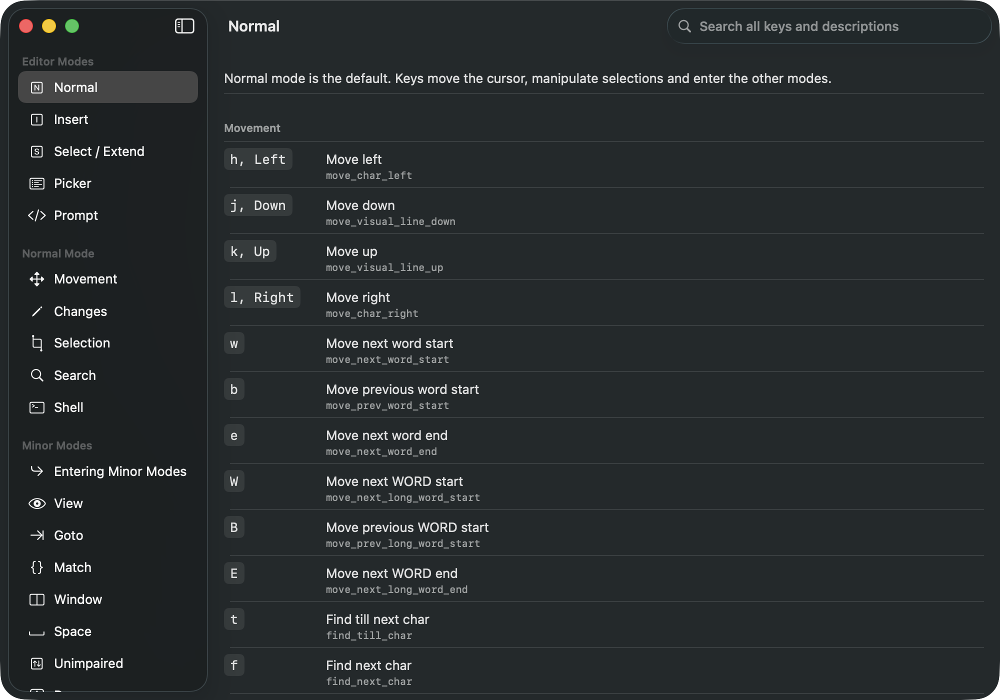

# helix-guide

A study guide for learning the [Helix](https://helix-editor.com) editor, built as a native
SwiftUI app for Apple platforms.

Helix is a modal editor with a large keymap. `hxguide` puts that keymap in a browsable,
searchable reference you can keep open beside your terminal while the bindings sink in —
every editor mode, every minor mode, and the built-in `:` commands.

## Content currency

**Verified against Helix 25.07.1 — reconciled 2026-07-19.**

Every table in the app was diffed row-by-row against the book source for that release
tag: [`book/src/keymap.md`](https://github.com/helix-editor/helix/blob/25.07.1/book/src/keymap.md)
and the generated
[`book/src/generated/typable-cmd.md`](https://github.com/helix-editor/helix/blob/25.07.1/book/src/generated/typable-cmd.md).
The guide targets the latest **stable** release rather than `master`, so it teaches what
users actually have installed.

The version is also surfaced in the app under **About**, and asserted by the test suite —
`testTablesHaveExpectedCounts` pins an exact row count per table, so an upstream sync
cannot land without deliberately restating the numbers. When refreshing content, bump
`Helix.verifiedAgainstVersion` in `hxguide/helix.swift` and re-diff every table.

## Screenshot



## Features

- **Every mode covered** — normal, insert, select/extend, picker and prompt.
- **Normal-mode categories** — movement, changes, selection manipulation, search and shell.
- **All seven minor modes** — view, goto, match, window, space, unimpaired and popup
  (including the completion menu and signature-help popup).
- **Built-in commands** — the full `:` command reference.
- **One unified search** — filters by keystroke *and* description, so searching `gg`,
  `Ctrl-w` or `|` finds the binding, not just prose that happens to mention it.
- **Configuration** — where `config.toml` lives on macOS, Linux and Windows.

## Platforms

| Platform | Minimum |
| --- | --- |
| macOS | 13.3 |
| iOS / iPadOS | 16.4 |

A single multiplatform target (`hxguide`) builds for both. The layout is a
`NavigationSplitView`: a sidebar and detail pane on Mac and iPad, collapsing to a
navigable stack on iPhone.

## Building

Requires Xcode 14.3 or later.

```sh
git clone https://github.com/jhoughjr/helix-guide.git
cd helix-guide
open hxguide.xcodeproj
```

Then pick the `hxguide` scheme and a Mac or iOS destination, and run.

From the command line:

```sh
# macOS
xcodebuild -project hxguide.xcodeproj -scheme hxguide \
  -configuration Debug -destination 'platform=macOS' build

# iOS Simulator
xcodebuild -project hxguide.xcodeproj -scheme hxguide \
  -configuration Debug -destination 'generic/platform=iOS Simulator' build
```

## Tests

The unit tests cover the guide's data integrity (no empty or whitespace-padded keys, no
duplicate bindings within a mode, expected minimum row counts) and the search-filter logic:

```sh
xcodebuild -project hxguide.xcodeproj -scheme hxguide \
  -configuration Debug -destination 'platform=macOS' \
  -only-testing:hxguideTests test
```

## Credits

All keybinding and command content comes from the
[Helix documentation](https://docs.helix-editor.com/keymap.html). Helix is an independent
project — this app is an unofficial study aid and is not affiliated with or endorsed by it.

Built with [Swift](https://swift.org) and SwiftUI. Helix itself is written in
[Rust](https://rust-lang.org).

## License

See [LICENSE](LICENSE).
